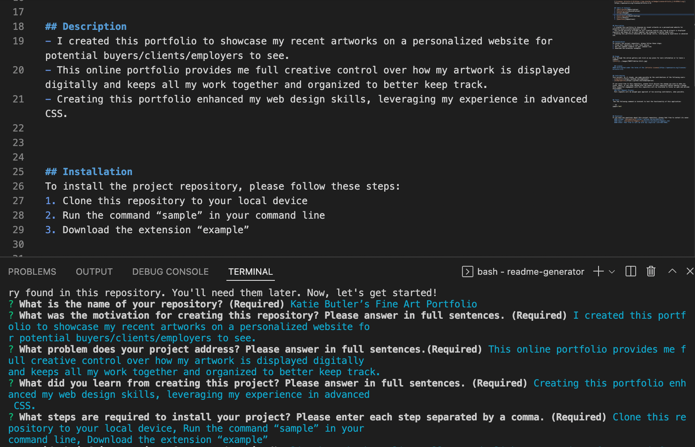
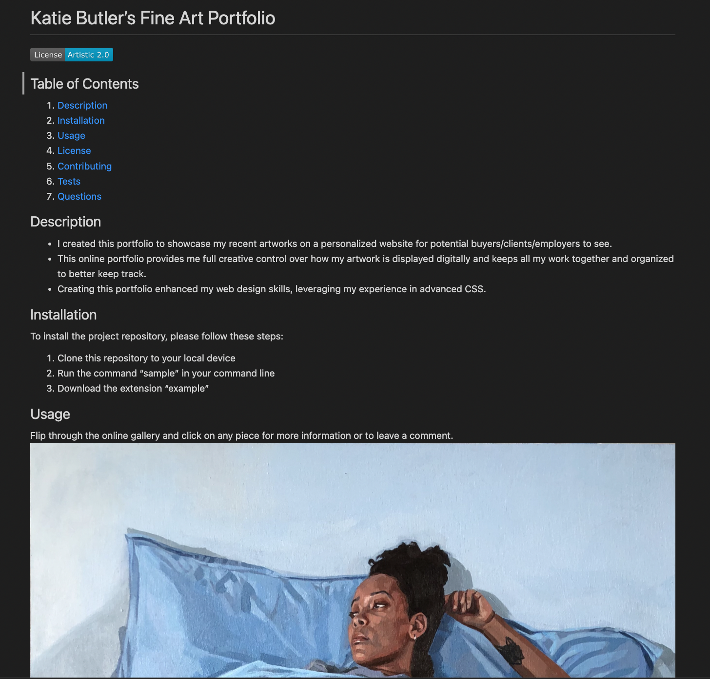

# Professional README Generator

  ## Table of Contents
  1. [Description](#description)
  2. [Installation](#installation)
  3. [Usage](#usage)
  4. [License](#license)
  5. [Contributing](#contributing)
  6. [Tests](#tests)
  7. [Questions](#questions)
   
## Description
- The motivation for creating this repository was to limit the amount of time spent creating README files in the final stages of project development and deployment.
- This application helps to avoid incomplete or lower quality README files from being created, while also guiding the user through prompts to make structuring the file much easier.
- While creating this application, I was able to apply new knowledge of Node.js, Inquirer and template literals in JavaScript, learning new development skills and strengthening existing skills in ES6 and markdown.
   
## Installation
To install the project repository, please follow these steps:
1. Clone my repository to your own on your local device.
2. Navigate into the repository root directory.
3. Enter ```npm install ``` into the command line to get access to all the necessary node modules.

## Usage
To get started creating your personalized README with the Professional README Generator...
1. Place any images/screenshots you would like to have displayed in the README file into the directory titled "images".
2. Enter ```node index.js ```into the command line terminal.
3. Follow all prompt instructions to answer the questions carefully.
4. After the final question is answered, go into the "dist" directory to find your newly generated README.md!
5. Adjust as desired for further customization.
6. Copy the file and add it to whatever project you'd like!





### Video Demonstration

https://user-images.githubusercontent.com/103510105/177679807-9440f84f-4435-4991-a227-3a7355d431bf.mp4

## License
This project is not licensed.

## Contributing
This project was created based off of starter code supplied by the University of Toronto School of Continuing Studies Coding Bootcamp. 
There are no additional contributors to credit beyond the repository owner for this project.

If you would like to this repository, please first discuss the change you wish to make via issue, email, or any other method with the owner of this repository before making a change. Only respectful engagement with this repository will be tolerated to foster an open and welcome environment.
  ### Pull Request Process
  - Pull requests will be merged upon approval of the repository owner.

## Tests
 There are currently no tests created to check the functionality of this application.
 
## Questions
If you have any questions about this project repository, please feel free to contact its owner.
  #### GitHub: [katiebutler37](https://github.com/katiebutler37)
  #### Email: [katiebutler37@gmail.com](mailto:katiebutler37@gmail.com)

    
